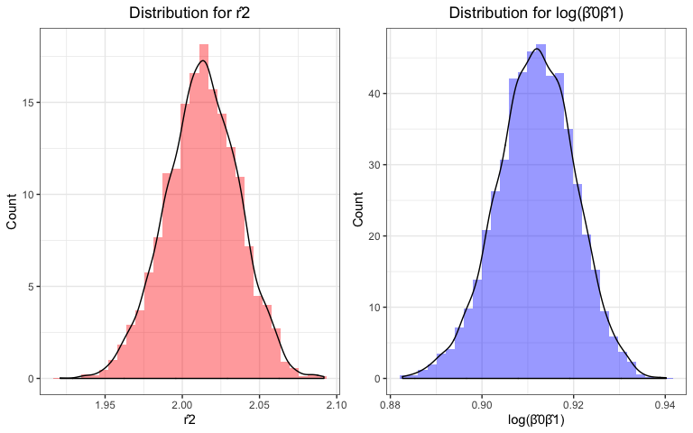

p8105\_hw6\_zl2860
================
Zongchao Liu
11/16/2019

# Probelm 1

## Load data and check data

``` r
set.seed(886) # reproducible
birthweight = read_csv('./data/birthweight.csv')
skimr::skim(birthweight)
```

    ## Skim summary statistics
    ##  n obs: 4342 
    ##  n variables: 20 
    ## 
    ## ── Variable type:numeric ─────────────────────────────────────────────────────────────────────────────────────────────────────────────────
    ##  variable missing complete    n      mean      sd     p0     p25     p50
    ##   babysex       0     4342 4342    1.49     0.5     1       1       1   
    ##     bhead       0     4342 4342   33.65     1.62   21      33      34   
    ##   blength       0     4342 4342   49.75     2.72   20      48      50   
    ##       bwt       0     4342 4342 3114.4    512.15  595    2807    3132.5 
    ##     delwt       0     4342 4342  145.57    22.21   86     131     143   
    ##   fincome       0     4342 4342   44.11    25.98    0      25      35   
    ##     frace       0     4342 4342    1.66     0.85    1       1       2   
    ##   gaweeks       0     4342 4342   39.43     3.15   17.7    38.3    39.9 
    ##   malform       0     4342 4342    0.0035   0.059   0       0       0   
    ##  menarche       0     4342 4342   12.51     1.48    0      12      12   
    ##   mheight       0     4342 4342   63.49     2.66   48      62      63   
    ##    momage       0     4342 4342   20.3      3.88   12      18      20   
    ##     mrace       0     4342 4342    1.63     0.77    1       1       2   
    ##    parity       0     4342 4342    0.0023   0.1     0       0       0   
    ##   pnumlbw       0     4342 4342    0        0       0       0       0   
    ##   pnumsga       0     4342 4342    0        0       0       0       0   
    ##     ppbmi       0     4342 4342   21.57     3.18   13.07   19.53   21.03
    ##      ppwt       0     4342 4342  123.49    20.16   70     110     120   
    ##    smoken       0     4342 4342    4.15     7.41    0       0       0   
    ##    wtgain       0     4342 4342   22.08    10.94  -46      15      22   
    ##      p75   p100     hist
    ##     2       2   ▇▁▁▁▁▁▁▇
    ##    35      41   ▁▁▁▁▅▇▁▁
    ##    51      63   ▁▁▁▁▁▇▁▁
    ##  3459    4791   ▁▁▁▃▇▇▂▁
    ##   157     334   ▁▇▅▁▁▁▁▁
    ##    65      96   ▁▂▇▂▂▂▁▃
    ##     2       8   ▇▇▁▁▁▁▁▁
    ##    41.1    51.3 ▁▁▁▁▃▇▁▁
    ##     0       1   ▇▁▁▁▁▁▁▁
    ##    13      19   ▁▁▁▁▂▇▁▁
    ##    65      77   ▁▁▁▅▇▂▁▁
    ##    22      44   ▂▇▅▂▁▁▁▁
    ##     2       4   ▇▁▇▁▁▁▁▁
    ##     0       6   ▇▁▁▁▁▁▁▁
    ##     0       0   ▁▁▁▇▁▁▁▁
    ##     0       0   ▁▁▁▇▁▁▁▁
    ##    22.91   46.1 ▁▇▅▁▁▁▁▁
    ##   134     287   ▁▇▆▁▁▁▁▁
    ##     5      60   ▇▁▁▁▁▁▁▁
    ##    28      89   ▁▁▁▇▇▁▁▁

``` r
birthweight =
  birthweight %>%
  mutate(babysex = factor(babysex),
         frace = factor(frace),
         malform = factor(malform),
         mrace = factor(mrace)
         )
```

The dataset has 4342 observations with 20 variables. The brief summary
above shows that there is no missing value in all variables. For
regression analysis, we transform `babysex`, `frace`, `malform`,
`mfrace` to factors.

## Modeling

The following modeling process is based on an automatic approach
(stepwise).

The process of stepwise regression is:

1.  Suppose X1 is the first variable added

2.  The next step is to fit all regressions with two X variables, X1
    being one of them

3.  For each regression a t-statistics of the new X is obtained

4.  The new X variable with the largest t-stats (smallest p-value) is
    the next candidate

5.  If t-stats \> some predefined level, the second X is then added

6.  If not, the program terminates

7.  Suppose x2 was added second; the procedure now examines whether any
    of the other X variables already in the model should be dropped

8.  The X value with the smallest t-stats (highest p-value) is dropped

9.  The process above repeats until all the variables have been
    considered by the computer

<!-- end list -->

``` r
# select features
step(lm(bwt ~ ., data = birthweight), direction = "both")
```

    ## Start:  AIC=48717.83
    ## bwt ~ babysex + bhead + blength + delwt + fincome + frace + gaweeks + 
    ##     malform + menarche + mheight + momage + mrace + parity + 
    ##     pnumlbw + pnumsga + ppbmi + ppwt + smoken + wtgain
    ## 
    ## 
    ## Step:  AIC=48717.83
    ## bwt ~ babysex + bhead + blength + delwt + fincome + frace + gaweeks + 
    ##     malform + menarche + mheight + momage + mrace + parity + 
    ##     pnumlbw + pnumsga + ppbmi + ppwt + smoken
    ## 
    ## 
    ## Step:  AIC=48717.83
    ## bwt ~ babysex + bhead + blength + delwt + fincome + frace + gaweeks + 
    ##     malform + menarche + mheight + momage + mrace + parity + 
    ##     pnumlbw + ppbmi + ppwt + smoken
    ## 
    ## 
    ## Step:  AIC=48717.83
    ## bwt ~ babysex + bhead + blength + delwt + fincome + frace + gaweeks + 
    ##     malform + menarche + mheight + momage + mrace + parity + 
    ##     ppbmi + ppwt + smoken
    ## 
    ##            Df Sum of Sq       RSS   AIC
    ## - frace     4    124365 320848704 48712
    ## - malform   1      1419 320725757 48716
    ## - ppbmi     1      6346 320730684 48716
    ## - momage    1     28661 320752999 48716
    ## - mheight   1     66886 320791224 48717
    ## - menarche  1    111679 320836018 48717
    ## - ppwt      1    131132 320855470 48718
    ## <none>                  320724338 48718
    ## - fincome   1    193454 320917792 48718
    ## - parity    1    413584 321137922 48721
    ## - mrace     3    868321 321592659 48724
    ## - babysex   1    853796 321578134 48727
    ## - gaweeks   1   4611823 325336161 48778
    ## - smoken    1   5076393 325800732 48784
    ## - delwt     1   8008891 328733230 48823
    ## - blength   1 102050296 422774634 49915
    ## - bhead     1 106535716 427260054 49961
    ## 
    ## Step:  AIC=48711.51
    ## bwt ~ babysex + bhead + blength + delwt + fincome + gaweeks + 
    ##     malform + menarche + mheight + momage + mrace + parity + 
    ##     ppbmi + ppwt + smoken
    ## 
    ##            Df Sum of Sq       RSS   AIC
    ## - malform   1      1447 320850151 48710
    ## - ppbmi     1      6975 320855679 48710
    ## - momage    1     28379 320877083 48710
    ## - mheight   1     69502 320918206 48710
    ## - menarche  1    115708 320964411 48711
    ## - ppwt      1    133961 320982665 48711
    ## <none>                  320848704 48712
    ## - fincome   1    194405 321043108 48712
    ## - parity    1    414687 321263390 48715
    ## + frace     4    124365 320724338 48718
    ## - babysex   1    852133 321700837 48721
    ## - gaweeks   1   4625208 325473911 48772
    ## - smoken    1   5036389 325885093 48777
    ## - delwt     1   8013099 328861802 48817
    ## - mrace     3  13540415 334389119 48885
    ## - blength   1 101995688 422844392 49908
    ## - bhead     1 106662962 427511666 49956
    ## 
    ## Step:  AIC=48709.53
    ## bwt ~ babysex + bhead + blength + delwt + fincome + gaweeks + 
    ##     menarche + mheight + momage + mrace + parity + ppbmi + ppwt + 
    ##     smoken
    ## 
    ##            Df Sum of Sq       RSS   AIC
    ## - ppbmi     1      6928 320857079 48708
    ## - momage    1     28660 320878811 48708
    ## - mheight   1     69320 320919470 48708
    ## - menarche  1    116027 320966177 48709
    ## - ppwt      1    133894 320984044 48709
    ## <none>                  320850151 48710
    ## - fincome   1    193784 321043934 48710
    ## + malform   1      1447 320848704 48712
    ## - parity    1    414482 321264633 48713
    ## + frace     4    124393 320725757 48716
    ## - babysex   1    851279 321701430 48719
    ## - gaweeks   1   4624003 325474154 48770
    ## - smoken    1   5035195 325885346 48775
    ## - delwt     1   8029079 328879230 48815
    ## - mrace     3  13553320 334403471 48883
    ## - blength   1 102009225 422859375 49906
    ## - bhead     1 106675331 427525481 49954
    ## 
    ## Step:  AIC=48707.63
    ## bwt ~ babysex + bhead + blength + delwt + fincome + gaweeks + 
    ##     menarche + mheight + momage + mrace + parity + ppwt + smoken
    ## 
    ##            Df Sum of Sq       RSS   AIC
    ## - momage    1     29211 320886290 48706
    ## - menarche  1    117635 320974714 48707
    ## <none>                  320857079 48708
    ## - fincome   1    195199 321052278 48708
    ## + ppbmi     1      6928 320850151 48710
    ## + malform   1      1400 320855679 48710
    ## - parity    1    412984 321270064 48711
    ## + frace     4    125020 320732060 48714
    ## - babysex   1    850020 321707099 48717
    ## - mheight   1   1078673 321935752 48720
    ## - ppwt      1   2934023 323791103 48745
    ## - gaweeks   1   4621504 325478583 48768
    ## - smoken    1   5039368 325896447 48773
    ## - delwt     1   8024939 328882018 48813
    ## - mrace     3  13551444 334408523 48881
    ## - blength   1 102018559 422875638 49904
    ## - bhead     1 106821342 427678421 49953
    ## 
    ## Step:  AIC=48706.02
    ## bwt ~ babysex + bhead + blength + delwt + fincome + gaweeks + 
    ##     menarche + mheight + mrace + parity + ppwt + smoken
    ## 
    ##            Df Sum of Sq       RSS   AIC
    ## - menarche  1    100121 320986412 48705
    ## <none>                  320886290 48706
    ## - fincome   1    240800 321127090 48707
    ## + momage    1     29211 320857079 48708
    ## + ppbmi     1      7479 320878811 48708
    ## + malform   1      1678 320884612 48708
    ## - parity    1    431433 321317724 48710
    ## + frace     4    124743 320761547 48712
    ## - babysex   1    841278 321727568 48715
    ## - mheight   1   1076739 321963029 48719
    ## - ppwt      1   2913653 323799943 48743
    ## - gaweeks   1   4676469 325562760 48767
    ## - smoken    1   5045104 325931394 48772
    ## - delwt     1   8000672 328886962 48811
    ## - mrace     3  14667730 335554021 48894
    ## - blength   1 101990556 422876847 49902
    ## - bhead     1 106864308 427750598 49952
    ## 
    ## Step:  AIC=48705.38
    ## bwt ~ babysex + bhead + blength + delwt + fincome + gaweeks + 
    ##     mheight + mrace + parity + ppwt + smoken
    ## 
    ##            Df Sum of Sq       RSS   AIC
    ## <none>                  320986412 48705
    ## + menarche  1    100121 320886290 48706
    ## - fincome   1    245637 321232048 48707
    ## + momage    1     11698 320974714 48707
    ## + ppbmi     1      8823 320977589 48707
    ## + malform   1      1884 320984528 48707
    ## - parity    1    422770 321409181 48709
    ## + frace     4    128726 320857686 48712
    ## - babysex   1    846134 321832545 48715
    ## - mheight   1   1012240 321998651 48717
    ## - ppwt      1   2907049 323893461 48743
    ## - gaweeks   1   4662501 325648912 48766
    ## - smoken    1   5073849 326060260 48771
    ## - delwt     1   8137459 329123871 48812
    ## - mrace     3  14683609 335670021 48894
    ## - blength   1 102191779 423178191 49903
    ## - bhead     1 106779754 427766166 49950

    ## 
    ## Call:
    ## lm(formula = bwt ~ babysex + bhead + blength + delwt + fincome + 
    ##     gaweeks + mheight + mrace + parity + ppwt + smoken, data = birthweight)
    ## 
    ## Coefficients:
    ## (Intercept)     babysex2        bhead      blength        delwt  
    ##   -6098.822       28.558      130.777       74.947        4.107  
    ##     fincome      gaweeks      mheight       mrace2       mrace3  
    ##       0.318       11.592        6.594     -138.792      -74.887  
    ##      mrace4       parity         ppwt       smoken  
    ##    -100.678       96.305       -2.676       -4.843

``` r
# build models with selected features
fit_bw_selected =
  lm(bwt ~ babysex + bhead + blength +delwt +fincome
     + gaweeks + mheight + mrace + parity +
       ppwt + smoken, data = birthweight)
summary(fit_bw_selected) %>%
  broom::tidy() %>%
  knitr::kable()
```

| term        |       estimate |   std.error |   statistic |   p.value |
| :---------- | -------------: | ----------: | ----------: | --------: |
| (Intercept) | \-6098.8219113 | 137.5463421 | \-44.340124 | 0.0000000 |
| babysex2    |     28.5580171 |   8.4548958 |    3.377690 | 0.0007374 |
| bhead       |    130.7770408 |   3.4465672 |   37.944144 | 0.0000000 |
| blength     |     74.9471109 |   2.0190479 |   37.120027 | 0.0000000 |
| delwt       |      4.1067316 |   0.3920592 |   10.474775 | 0.0000000 |
| fincome     |      0.3180229 |   0.1747477 |    1.819898 | 0.0688436 |
| gaweeks     |     11.5924873 |   1.4620657 |    7.928842 | 0.0000000 |
| mheight     |      6.5940377 |   1.7848817 |    3.694383 | 0.0002231 |
| mrace2      |  \-138.7924801 |   9.9070869 | \-14.009414 | 0.0000000 |
| mrace3      |   \-74.8867755 |  42.3146313 |  \-1.769761 | 0.0768374 |
| mrace4      |  \-100.6781427 |  19.3246910 |  \-5.209819 | 0.0000002 |
| parity      |     96.3046933 |  40.3362158 |    2.387549 | 0.0170038 |
| ppwt        |    \-2.6755853 |   0.4273585 |  \-6.260752 | 0.0000000 |
| smoken      |    \-4.8434197 |   0.5855757 |  \-8.271210 | 0.0000000 |

``` r
birthweight %>%
  add_predictions(fit_bw_selected) %>%
  add_residuals(fit_bw_selected) %>%
  ggplot(aes( x = pred, y = resid ) ) +
  geom_point(alpha = .4) +
  theme_bw() +
  labs(title = " Residual vs Fitted Values") +
  theme(plot.title = element_text(hjust =.5)) +
  geom_line(aes(y = 0), color = "blue")
```

<!-- -->

The regression result is shown in the table above. The resulting model
includes `babysex, bhead, blength, delwt, fincome, gaweeks, mheight,
mrace, parity, ppwt, smoken` as the predictors. The redisual plot
indicates that the variance of the residuals are constant while the
predicted values are approximately higher than 2000.

## Build two models

The following are the regression results for the two other models:

``` r
fit_main = lm(bwt ~ blength + gaweeks ,data = birthweight)
fit_inter = lm(bwt ~ bhead * blength * babysex ,data = birthweight)
summary(fit_main) %>%
  broom::tidy()
```

    ## # A tibble: 3 x 5
    ##   term        estimate std.error statistic  p.value
    ##   <chr>          <dbl>     <dbl>     <dbl>    <dbl>
    ## 1 (Intercept)  -4348.      98.0      -44.4 0.      
    ## 2 blength        129.       1.99      64.6 0.      
    ## 3 gaweeks         27.0      1.72      15.7 2.36e-54

``` r
summary(fit_inter) %>%
  broom::tidy()
```

    ## # A tibble: 8 x 5
    ##   term                    estimate std.error statistic      p.value
    ##   <chr>                      <dbl>     <dbl>     <dbl>        <dbl>
    ## 1 (Intercept)            -7177.     1265.       -5.67  0.0000000149
    ## 2 bhead                    182.       38.1       4.78  0.00000184  
    ## 3 blength                  102.       26.2       3.90  0.0000992   
    ## 4 babysex2                6375.     1678.        3.80  0.000147    
    ## 5 bhead:blength             -0.554     0.780    -0.710 0.478       
    ## 6 bhead:babysex2          -198.       51.1      -3.88  0.000105    
    ## 7 blength:babysex2        -124.       35.1      -3.52  0.000429    
    ## 8 bhead:blength:babysex2     3.88      1.06      3.67  0.000245

## Making comparisons in terms of the CV prediction error

``` r
cv_df = 
  crossv_mc(birthweight,1000) %>%
  mutate(train = map(train, as_tibble),
         test = map (test, as_tibble),
         model_selected = map(train, ~lm(bwt ~ babysex + bhead + blength +delwt +fincome + gaweeks + mheight + mrace + parity + ppwt + smoken, data = .x)),
         model_main = map(train, ~lm(bwt ~ gaweeks , data = .x)),
         model_inter = map(train,~lm(bwt ~ bhead * blength * babysex , data = .x)),
         ) %>%
  mutate(rmse_main = map2_dbl(model_main, test, ~rmse(model = .x, data = .y)),
         rmse_inter = map2_dbl(model_inter, test, ~rmse(model = .x, data = .y)),
         rmse_selected = map2_dbl(model_selected, test, ~rmse(model = .x, data =.y)))

cv_df %>%
  select(starts_with("rmse")) %>%
  pivot_longer(everything(),
               names_to = "model",
               values_to = "rmse",
               names_prefix = "rmse_") %>%
  ggplot(aes(x = model, y = rmse, fill = model)) +
  geom_violin() +
  ggsci::scale_fill_lancet() +
  theme_bw() +
  labs(title = "Model Comparison") +
  theme( plot.title = element_text(hjust = .5))
```

<!-- -->

The plot above shows the distribution of the RMSE values for each
candidate model. By using the corss validation, we see that there is
difference in the prediction error (RMSE) among the three different
models. The model that only considers the main effects has the highest
average prediction error than the others. The model built by stepwise
approach (selected model) has the lowest average RMSE. Therefore, based
on the criterion of RMSE, we conclude that the model that includes
`babysex, bhead, blength, delwt, fincome, gaweeks, mheight, mrace,
parity, ppwt, smoken` is the best for prediction among the three models.

# Problem 2

## Load data

``` r
weather_df = 
  rnoaa::meteo_pull_monitors(
    c("USW00094728"),
    var = c("PRCP", "TMIN", "TMAX"), 
    date_min = "2017-01-01",
    date_max = "2017-12-31") %>%
  mutate(
    name = recode(id, USW00094728 = "CentralPark_NY"),
    tmin = tmin / 10,
    tmax = tmax / 10) %>%
  select(name, id, everything())
```

## Create a function for resampling data with replacement

``` r
boot_sample = 
  function(df){
  sample_frac(df, replace = T)
  }
```

## Bootstrap

``` r
#resample 5000 times
bootstrap_df = 
  tibble(
    sample_id = 1 : 5000,
    sample = rerun(5000,boot_sample(weather_df))
  )

# organize results
estimates =
  bootstrap_df %>%
  mutate(model = map(sample, ~lm(tmax ~ tmin, data = .x)),
         result_r = map(model, broom::glance),
         result_beta = map(model, broom::tidy)) %>%
  select(sample_id,result_r, result_beta) %>%
  unnest() %>%
  mutate(term = recode(term, 
                       "(Intercept)" = "beta_0",
                       "tmin" = "beta_1")) %>%
  janitor::clean_names() %>%
  select(sample_id, r_squared, adj_r_squared,term, estimate) %>%
  pivot_wider( names_from = term,
               values_from = estimate) %>%
  mutate(log_beta = log(beta_1 * beta_0))
```

## Plot the distributions

``` r
# distribution for beta
plt_beta =
  estimates %>%
  ggplot(aes( x = r_squared, y =..density..)) +
  geom_histogram(fill = "blue", alpha = .4) +
  geom_density(aes( x = r_squared, y = ..density..)) +
  theme_bw() +
  labs(title = "Distribution for log(β̂0β̂1)",
       x = "log(β̂0β̂1)",
       y = " Count") +
  theme(plot.title = element_text(hjust = .5 ))

# distribution for r2
plt_rsq =
  estimates %>%
  ggplot(aes( x = log_beta, y = ..density..)) +
  geom_histogram(fill = "red", alpha = .4) +
  theme_bw() +
  geom_density(aes( x = log_beta, y = ..density..)) +
  labs(title = "Distribution for r̂2",
       x = "r̂2",
       y = "Count") +
  theme(plot.title = element_text(hjust = .5 ))  

plt_rsq + plt_beta
```

<!-- -->

From the plot above, we see that the distributions of the r\_hat-squared
and log(beta\_0\_hat \* beta\_1\_hat) are both nearly normal

## 95% CI

``` r
quantile(pull(estimates,log_beta), c(.25, .975))
```

    ##      25%    97.5% 
    ## 1.997271 2.058470

``` r
quantile(pull(estimates,r_squared), c(.25, .975))
```

    ##       25%     97.5% 
    ## 0.9061750 0.9278682

The 95% confidence interval for log(β̂ 0∗β̂ 1) is (1.997271, 2.05847)

The 95% confidence interval for r̂2 is (0.9061750, 0.9278682)
